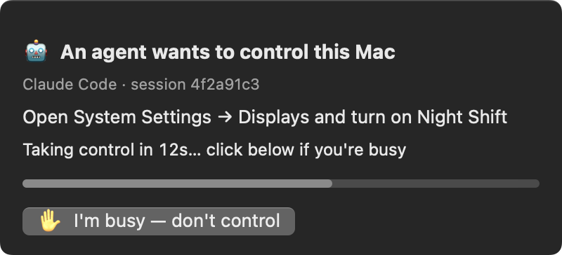
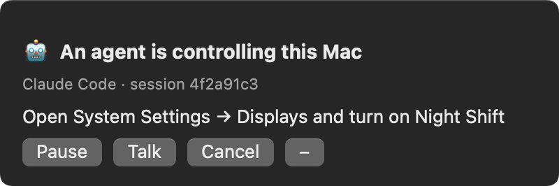
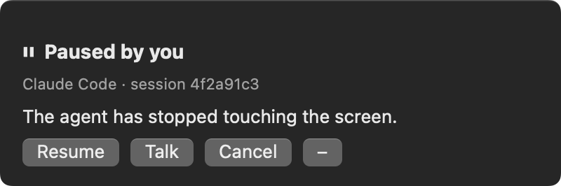

# screen-claim

**A Pause button for an AI agent driving your Mac.**

Before the agent touches anything, a small panel in the corner says what it wants to do
and counts down. While it drives, the panel stays up with **Pause**, **Talk** and
**Cancel**, and those buttons actually stop it: Pause kills the click or keystroke in
flight, and a Claude Code hook refuses every further screen action until you press Resume.

| Asking | Driving | Paused |
|---|---|---|
|  |  |  |

The hands are [peekaboo](https://github.com/openclaw/Peekaboo). This repo is the layer
around them: consent, control, one agent at a time, and the [rules](PLAYBOOK.md) that keep
keystrokes out of the wrong app.

> **Reference code, not a maintained product.** It is small on purpose. Read it, copy it,
> or point your agent at the write-up and have it build its own.

## What's in it

| Path | |
|---|---|
| `overlay/main.swift` | The panel. A non-activating `NSPanel` (never steals focus, floats over every Space). Speaks a line protocol: prints `GRANT` `DENY` `STOP` `RESUME` `CANCEL` `MSG <text>`, reads `DOING <text>` `PAUSED` `RESUMED` `TALK [text]` `HIDE`. Options: `--width <pt>` and `--text-scale <x>` for small screens. |
| `bin/screen-claim` | What the agent runs: `start "<goal>"`, `doing`, `stop`, `status`, `stopped`, `inbox`, `resume`. |
| `bin/watch.mjs` | Runs the panel for one claim and turns presses into state: `interrupt.json` on Pause/Cancel (plus `pkill` of peekaboo/cliclick), `inbox.jsonl` for Talk. Renews the claim's lock and keeps the Mac awake while the claim is held. |
| `bin/agent-lock.mjs` | A per-device lock any agent can take: TTL, wait queue, interrupt flag, master switch, optionally stored on an adb device. The Mac's claim is its `mac-screen` resource. See [One lock per device](#one-lock-per-device). |
| `hooks/screen-stop-gate.sh` | PreToolUse hook: while paused or cancelled, deny every screen-driving call. The deny reason carries the user's Talk messages, so the agent hears them on its next attempt. |
| `hooks/screen-lock-gate.sh` | PreToolUse hook: deny screen driving unless this session holds the `mac-screen` lock. One driver at a time, never one the user can't see. |
| `tools/type-to-pid.swift` | Send keystrokes to one process by pid, so they cannot land in whatever happens to have focus. |
| `tools/capture-panels.sh` | Screenshots the real panel in every state, by window id (desktop size, or `320 1.3 -mobile` for phones). |
| `tools/record-countdown.sh` + `tools/window-frames.swift` | Records the real panel's countdown turning into the banner, one window via ScreenCaptureKit, as a looping animated WebP. |
| `PLAYBOOK.md` | The rules for the agent. |

## Install

Needs macOS 14+, Xcode command-line tools, Node 18+, `jq`, and peekaboo
(`brew install openclaw/tap/peekaboo`) with Accessibility + Screen Recording granted.

```bash
git clone https://github.com/jrejaud/agent-device-locks ~/screen-claim
~/screen-claim/overlay/build.sh
ln -s ~/screen-claim/bin/screen-claim /usr/local/bin/screen-claim
```

Wire both hooks in `~/.claude/settings.json`:

```json
{
  "hooks": {
    "PreToolUse": [
      { "matcher": "Bash|mcp__peekaboo__.*|mcp__computer-use__.*",
        "hooks": [
          { "type": "command", "command": "~/screen-claim/hooks/screen-stop-gate.sh" },
          { "type": "command", "command": "~/screen-claim/hooks/screen-lock-gate.sh" }
        ] }
    ]
  }
}
```

Then add [PLAYBOOK.md](PLAYBOOK.md) to your agent's instructions.

### Optional

- `SCREEN_CLAIM_NOTIFY_CMD` — a command run with each button press as its argument (type it
  into the agent's terminal, push it to your phone). Without it the agent learns on its
  next screen action, through the hook.
- `SCREEN_CLAIM_FOCUS_CMD` — shows a **Go to session** button that runs this command, e.g.
  `open -a Terminal`.
- `SCREEN_CONSENT_SECS` (default 15), `SCREEN_CLAIM_WHO` (the label on the panel),
  `SCREEN_CLAIM_STATE` (default `~/.local/state/screen-claim`).


## One lock per device

Whatever an agent drives — this Mac's screen, a phone, a tablet, a headset — only one
agent should drive it at a time. `bin/agent-lock.mjs` is that lock, generic over a
resource name. It needs only Node.

- **TTL.** A lock lapses unless renewed, so a crashed agent cannot wedge a device. A
  *live* lock is never taken away: `steal` only adopts a lock whose holder stopped renewing.
- **Queue.** `acquire --wait N` waits in line; waiters are served in arrival order (or the
  order set with `reorder`), and a waiter that stops heartbeating drops out.
- **Interrupt.** Anyone can raise a stop flag on a resource (`interrupt`) without holding
  it; the holder sees it in `status --json` and stops. `resume` clears it.
- **Master switch.** `disable` makes every `acquire` refuse until `enable`.
- **On the device.** With `--device <serial>` the lock lives on the device itself
  (`/data/local/tmp/agent-locks`, over `adb`), so agents on different machines that reach
  the same phone see the same lock.

Holder identity is `$AGENT_LOCK_HOLDER`, else `<CLAUDE_CODE_SESSION_ID>@<hostname>`, else
`pid<n>@<hostname>` (one-shot: set one of the first two for anything longer than a call).
Local locks live under `$AGENT_LOCK_DIR` (default `~/.local/state/agent-locks`).

Wrap your own driving commands with it, e.g. an Android phone over adb:

```bash
L=~/screen-claim/bin/agent-lock.mjs; DEV=R5CW1234567     # adb devices
node $L acquire phone --device $DEV --ttl 300 --wait 600 --desc "Installing the beta build" || exit 1
trap 'node $L release phone --device $DEV' EXIT
adb -s $DEV install -r app-beta.apk
adb -s $DEV shell am start -n com.example/.MainActivity
node $L status phone --device $DEV --json | jq -e '.interrupted | not' >/dev/null || exit 0   # the user said stop
node $L renew phone --device $DEV --ttl 300                                                    # long job: keep it
```

Exit codes: `0` ok, `4` still held by someone else after `--wait`, `5` not yours (or a
live lock you tried to steal), `6` disabled. `queue --json` shows the holder and the line.

**The Mac uses the same lock.** `screen-claim start` takes the `mac-screen` agent-lock
(exit `4` if another agent holds it; `--wait N` to queue), its watcher renews it while the
overlay is up (`SCREEN_CLAIM_TTL`, default 60 s), and `stop` releases it. The lock hook asks
`agent-lock status mac-screen` whether the calling session is the holder. So
`node bin/agent-lock.mjs queue mac-screen` shows who is driving the Mac, and
`disable mac-screen` keeps every agent off it. Pause / Cancel / Talk stay overlay state in
`$SCREEN_CLAIM_STATE` and reach the agent through the stop hook's deny reason.

## Tests

```bash
test/agent-lock.test.sh  # the lock: refuse, queue order, steal, interrupt, disable (local storage)
test/hooks.test.sh       # both hooks, against a throwaway state dir
test/e2e.test.sh         # start → pause → talk → resume → cancel → stop, with a fake overlay
```

MIT.
